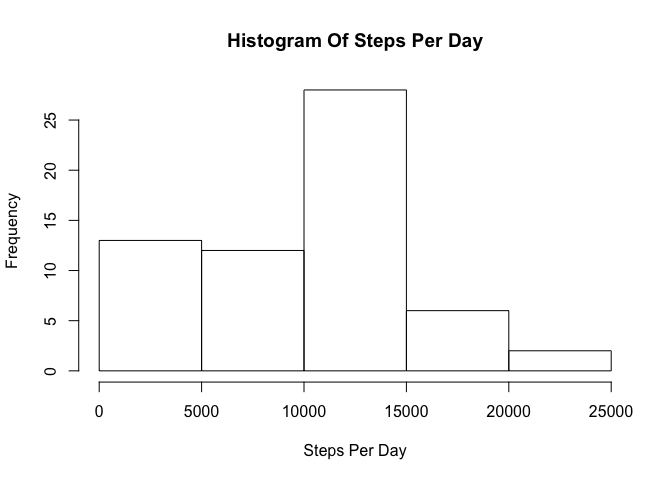
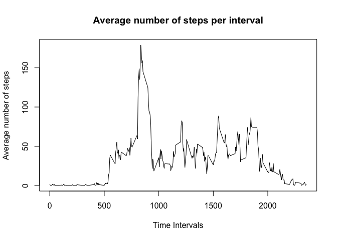
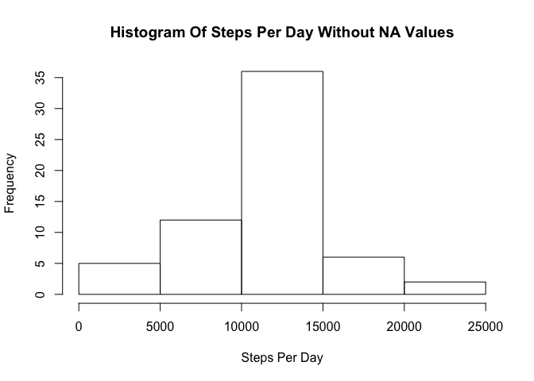
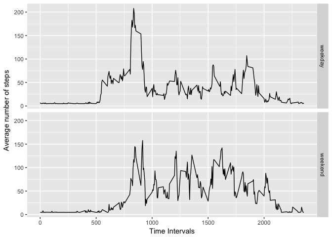

### Activity Monitoring

This is an R Markdown document used for computing the course project 1 of Reproducable Research module of Data Science on coursera.

Loading and preprocessing the data
----------------------------------

#### This code chunk loads the data and Transforms the dates

``` r
filename <- "repdata%2Fdata%2Factivity.zip"

## Download and unzip the dataset:
filename <- "repdata%2Fdata%2Factivity.zip"
if (!file.exists(filename)){
  fileURL <- "https://d396qusza40orc.cloudfront.net/repdata%2Fdata%2Factivity.zip"
  download.file(fileURL, filename, method="curl")
}  
if (!file.exists("activity.csv")) { 
  unzip(filename) 
}

raw_activity <- read.csv("activity.csv")

date_format <- factor(raw_activity$date)

raw_activity$date <- as.Date(date_format, format = "%Y-%m-%d")

raw_activity$steps[is.na(raw_activity$steps)] <- 0 
```

Mean total number of steps taken
--------------------------------

#### This code chunk computes the total number of steps taken each day

``` r
steps_per_day <- aggregate(raw_activity$steps, by=list(dates=raw_activity$date), FUN=sum)

print(steps_per_day)
```

    ##         dates     x
    ## 1  2012-10-01     0
    ## 2  2012-10-02   126
    ## 3  2012-10-03 11352
    ## 4  2012-10-04 12116
    ## 5  2012-10-05 13294
    ## 6  2012-10-06 15420
    ## 7  2012-10-07 11015
    ## 8  2012-10-08     0
    ## 9  2012-10-09 12811
    ## 10 2012-10-10  9900
    ## 11 2012-10-11 10304
    ## 12 2012-10-12 17382
    ## 13 2012-10-13 12426
    ## 14 2012-10-14 15098
    ## 15 2012-10-15 10139
    ## 16 2012-10-16 15084
    ## 17 2012-10-17 13452
    ## 18 2012-10-18 10056
    ## 19 2012-10-19 11829
    ## 20 2012-10-20 10395
    ## 21 2012-10-21  8821
    ## 22 2012-10-22 13460
    ## 23 2012-10-23  8918
    ## 24 2012-10-24  8355
    ## 25 2012-10-25  2492
    ## 26 2012-10-26  6778
    ## 27 2012-10-27 10119
    ## 28 2012-10-28 11458
    ## 29 2012-10-29  5018
    ## 30 2012-10-30  9819
    ## 31 2012-10-31 15414
    ## 32 2012-11-01     0
    ## 33 2012-11-02 10600
    ## 34 2012-11-03 10571
    ## 35 2012-11-04     0
    ## 36 2012-11-05 10439
    ## 37 2012-11-06  8334
    ## 38 2012-11-07 12883
    ## 39 2012-11-08  3219
    ## 40 2012-11-09     0
    ## 41 2012-11-10     0
    ## 42 2012-11-11 12608
    ## 43 2012-11-12 10765
    ## 44 2012-11-13  7336
    ## 45 2012-11-14     0
    ## 46 2012-11-15    41
    ## 47 2012-11-16  5441
    ## 48 2012-11-17 14339
    ## 49 2012-11-18 15110
    ## 50 2012-11-19  8841
    ## 51 2012-11-20  4472
    ## 52 2012-11-21 12787
    ## 53 2012-11-22 20427
    ## 54 2012-11-23 21194
    ## 55 2012-11-24 14478
    ## 56 2012-11-25 11834
    ## 57 2012-11-26 11162
    ## 58 2012-11-27 13646
    ## 59 2012-11-28 10183
    ## 60 2012-11-29  7047
    ## 61 2012-11-30     0

#### This code chunk produces the histogram of Steps Per Day

``` r
hist(steps_per_day$x,main = "Histogram Of Steps Per Day",xlab = "Steps Per Day")
```



#### This code chunk produces the mean and median of the total number of steps taken per day

``` r
summary(steps_per_day$x)
```

    ##    Min. 1st Qu.  Median    Mean 3rd Qu.    Max. 
    ##       0    6778   10395    9354   12811   21194

``` r
steps_mean<- mean(steps_per_day$x)
steps_median <- median(steps_per_day$x)

# Mean
print(steps_mean)
```

    ## [1] 9354

``` r
#Median
print(steps_median)
```

    ## [1] 10395

The mean of the total number of steps taken per day is **9354.23**

The median of the total number of steps taken per day is **10395**

Average daily activity pattern
------------------------------

#### This code chunk produces a time series plot

``` r
avg_steps_per_interval <- aggregate(raw_activity$steps ~ raw_activity$interval, raw_activity, mean)
plot(avg_steps_per_interval$`raw_activity$interval`,avg_steps_per_interval$`raw_activity$steps`, type='l', col=1, main="Average number of steps per interval", xlab="Time Intervals", ylab="Average number of steps")
```



#### maximum number of steps in 5 min interval

``` r
max_steps_row <- which.max(avg_steps_per_interval$`raw_activity$steps`)

avg_steps_per_interval[max_steps_row,]
```

    ##     raw_activity$interval raw_activity$steps
    ## 104                   835                179

Imputing missing values
-----------------------

#### Total Number Of Missing Values

``` r
# re - initialising the data
library(dplyr)
```

    ## 
    ## Attaching package: 'dplyr'

    ## The following objects are masked from 'package:stats':
    ## 
    ##     filter, lag

    ## The following objects are masked from 'package:base':
    ## 
    ##     intersect, setdiff, setequal, union

``` r
raw_activity <- read.csv("activity.csv")

date_format <- factor(raw_activity$date)

raw_activity$date <- as.Date(date_format, format = "%Y-%m-%d")

sum(is.na(raw_activity$steps))
```

    ## [1] 2304

The number of NA values in given dataset is **2304**

#### Filling up the missing values

``` r
new_steps <- raw_activity$steps

new_steps[is.na(new_steps)] <- mean(new_steps[!is.na(new_steps)])
```

#### Creating the new Dataset

``` r
refined_activity <- raw_activity
refined_activity$steps <- new_steps

refined_steps_per_day <- aggregate(refined_activity$steps, by=list(dates=refined_activity$date), FUN=sum)


### Histogram With no NA Values

hist(refined_steps_per_day$x,main = "Histogram Of Steps Per Day Without NA Values",xlab = "Steps Per Day")
```



``` r
summary(refined_steps_per_day$x)
```

    ##    Min. 1st Qu.  Median    Mean 3rd Qu.    Max. 
    ##      41    9819   10766   10766   12811   21194

``` r
redefined_steps_mean<- mean(refined_steps_per_day$x)
redefined_steps_median <- median(refined_steps_per_day$x)
```

The mean with NAs values in data was **9354.23** while the new mean is **10766.19**

The median with NAs values in data was **10395** while the new median is **10766.19**

patterns between weekdays and weekends
--------------------------------------

#### new factor variable in the dataset with two levels

``` r
refined_activity['day'] <- weekdays(refined_activity$date)

refined_activity$day[refined_activity$day %in% c('Saturday','Sunday')]<-"weekend"
refined_activity$day[refined_activity$day != "weekend"]<-"weekday"

refined_activity$day <- as.factor(refined_activity$day)
```

#### PLotting the TimeSeries

``` r
new_avg_steps_per_interval <- aggregate(steps ~ interval + day, data=refined_activity, mean)


library(ggplot2)

ggplot(new_avg_steps_per_interval, aes(interval, steps)) + 
  geom_line() + 
  facet_grid(day ~ .) +
  xlab("Time Intervals") + 
  ylab("Average number of steps")
```


